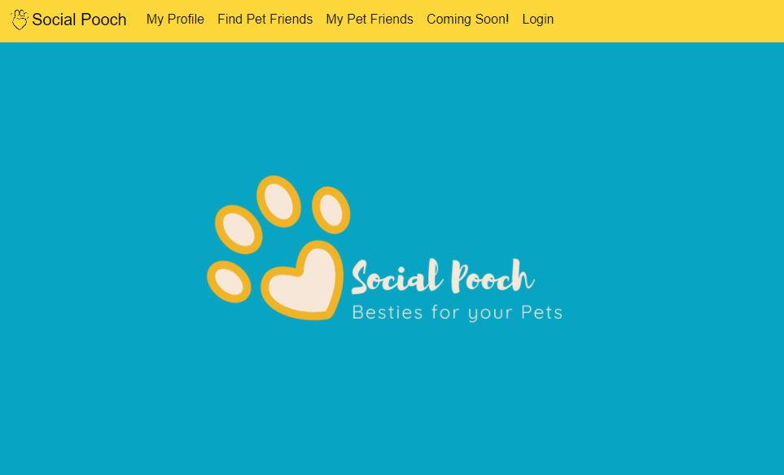

#  align="center"

# Project 3 - Social Pooch 

<br>

[](https://shields.io/)
[](https://shields.io/)
[](https://shields.io/)
[](https://shields.io/)
[](https://shields.io/)

## Description 

Pets Remain In High Demand During COVID. An estimated 11 million U.S. households have gotten a new pet during the pandemic. 
We wanted an easy and fun way to  help our pet friends meet other pet friends (with Human plus 1’s tagging along of course). 

As an adorable pet, I want to meet other pet friends so that I can have play dates with them at the park, or anywhere fun! 




## About This Boilerplate

The MERN boilerplate is for MongoExpressReactNode allows for a Node/Express/React app which can be easily deployed to Heroku.

The front-end React app will auto-reload as it's updated via webpack dev server, and the backend Express app will auto-reload independently with nodemon.

## Starting the app locally

Start by installing front and backend dependencies. While in this directory, run the following command:

```
npm install
```

This should install node modules within the server and the client folder.

After both installations complete, run the following command in your terminal:

```
npm start
```

Your app should now be running on <http://localhost:3000>. The Express server should intercept any AJAX requests from the client.

For seeding your database run

``` 
npm run seed
```

## Deployment (Heroku)

The project is deployed on [Social Pooch on Heroku](https://secure-fjord-72458.herokuapp.com/findpetfriends)

You can find the Social Pooch Repo on [GitHub](https://github.com/mklakhan/social-pooch).

## Development Assignments


```
Backend Development
Kristina Al-Ashqar and Kimberley Heuer
    * Folder Structure MVC standard for MERN
    * React
    * Mongo database with Mongoose ORM
    * API routing and database controllers
```

Aika Kuo and Manpreet Lakhan
```
Frontend Styling and Authenticaion
    * Firebase
    * React Bootstrap and native Bootstrap
```
